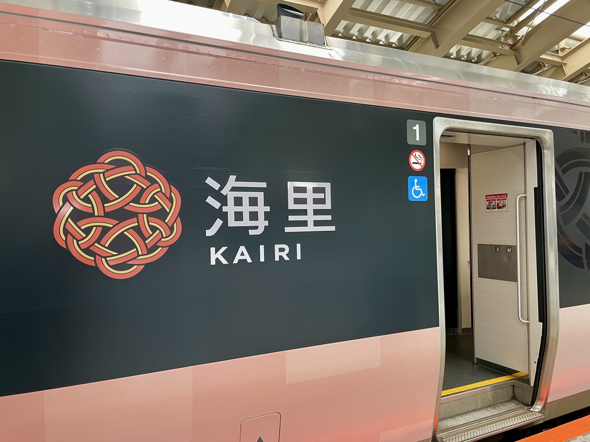
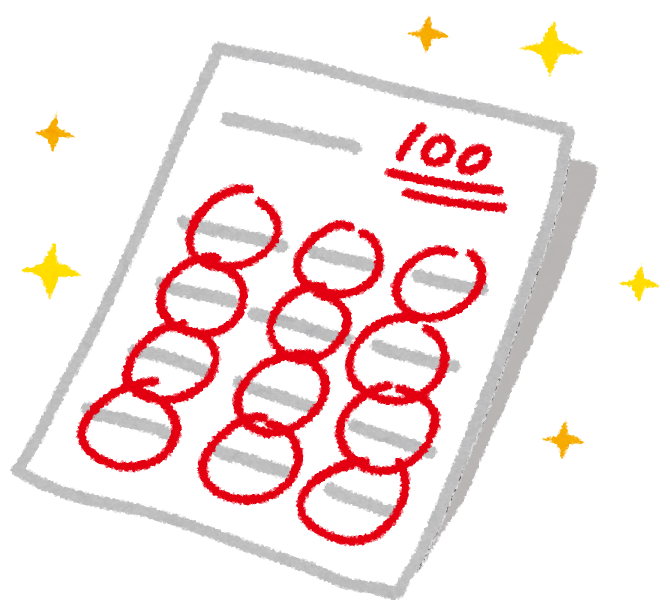

# Lightning Talk

【交流会】SKYWILL Beer Bash 3月

---

# 自己紹介

- 名前：平良一真
- 所属：ASD推進室

---

# 突然ですが・・・

---

# <!--fit-->単語テスト

---

---

# <!--fit-->Level 1

---

# 多態性

1. 読みを答えよ（5点）
1. 意味を答えよ（5点）

---

# 正解

## 多態性

- 読み：たたいせい
- 意味：同じインスタンスメソッドの振る舞いが、呼び出されたインスタンスの型や状態によって異なること

---

# <!--fit-->Level 2

---

# 高階関数

1. 読みを答えよ（5点）
1. 意味を答えよ（10点）

---

# 正解

## 高階関数

- 読み：こうかいかんすう
- 意味：関数を引数として取るか、関数を返り値として返す関数

---

# <!--fit-->Level 3

---

# UTC

1. この略称の正式名称を答えよ（10点）
1. 意味を答えよ（5点）

---

# 正解

## UTC

- 正式名称：coordinated universal time（英語）
- 意味：協定世界時、ロンドン・グリニッジにおける原子時計を用いた時刻で各国の標準時の基準とされる

---

# <!--fit-->Level 4

---

# ?:

1. この演算子の名称を答えよ（10点）
1. この演算子の意味を答えよ（10点）

---

# 正解

## ?:

- 名称：エルビス演算子
- 意味：言語によって異なるが、多くが次のうちいずれか
  - 左辺が真の場合左辺を返し偽の場合右辺を返す
    - 三項演算子の第二項が省略されたもの
  - 左辺がnullでない場合左辺を返しnullの場合右辺を返す
    - null合体演算子と同じもの
---

# <!--fit-->Level 5

---

# 冪等性

1. 読みを答えよ（20点）
1. 意味を答えよ（20点）

---

# 正解

## 冪等性

- 読み：べきとうせい
- 意味：同じ操作を複数回行ってもその状態が変わらないという性質

---

# 何点取れましたか？

