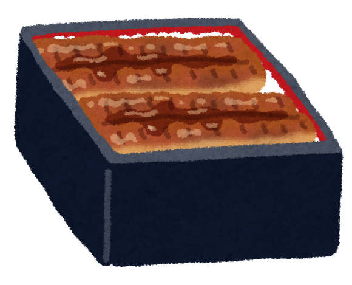
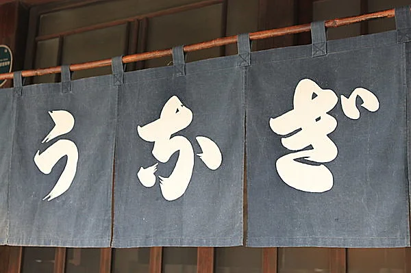
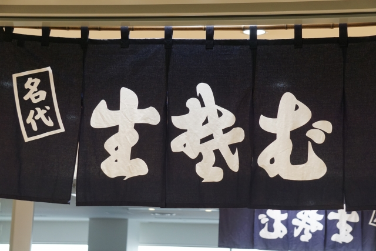
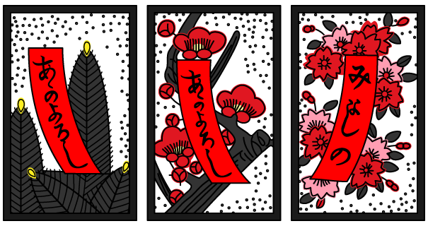

# Lightning Talk

CA Unit 2024-2HUnit会 5月

---

# 自己紹介

- 名前：平良一真
- 所属：ASD推進室



---

# 今日のテーマは
# う𛂁ぎについて


---

# Q. 𛂁 ←この文字何？



---

# A. 「変体仮名」と言われる文字

- 平仮名とは、漢字を崩して音にあてたもの
  - 例えば、「安 → あ」
- しかし、「あ」と読む漢字は多数あるため「あ」に対して多数の平仮名があり得る
  - 例えば、「阿 → 𛀄」、「惡 → 𛀅」
- このように多数ある平仮名を明治33年の「小学校令施行規則」において、学校で教える平仮名を1音1字に厳選した。
  - これに選ばれたのが現在の平仮名
  - これに選ばれなかったのが「標準で使用されない平仮名」という意味で「変体仮名」と呼ばれる

---

# 現代でも見かける変体仮名

---

# 生そば・きそば

- 「楚 → 𛁛」
- 「者 → 𛂦」（+濁点「𛂦゙」）



---

# あかよろし

- 「可 → 𛀙」



---

# お気付きの方もいらっしゃると思いますが・・・

---

# 変体仮名をスライドで使用している

# すなわち、文字コード（Unicode）・フォントがある

---

# コード上で使用できる！！

```Java
class Main {
  public static void main(String[] args) {
    System.out.println("う𛂁ぎ");
    // う𛂁ぎ
    System.out.println("き𛁛𛂦゙");
    // き𛁛𛂦゙
  }
}
```

---

# 変体仮名をコード上で使用する際の注意点

```Java
System.out.println("う𛂁ぎ".length());
// 4
System.out.println("き𛁛𛂦゙".length());
// 6
```

- 文字列のlengthが見た目の文字数より多くなる
  - ~~うなぎもそばも長いから~~
  - Unicodeのサロゲートペアと濁点の仕様（結合文字）のため

---

# サロゲートペアとは

2byte1文字が基本のUnicodeにおいて、4byteで1文字を表す文字のこと。
（2byteでは足りなくなったための苦肉の策。）

## 変体仮名もこのサロゲートペア

JavaではStringが内部的にcharの配列を持っていて、lengthがこの配列の長さを返すので、サロゲートペアが含まれると見た目の文字数とlengthにズレが生じる。

---

# 結合文字とは

基底文字とセットで使うことで1文字を表す文字。
例えば、平仮名（基底文字）と濁点（結合文字）で濁音（結合文字列）を表せる。

これも2byte + 2byteで1文字を表すため、lengthにズレが生じる。

## 他にもUnicodeには複数の文字で１つの文字を作る仕様があるが、闇が深いので注意

---

# これらを踏まえて先ほどのlengthの解説

```Java
System.out.println("う𛂁ぎ".length());
// 4
System.out.println("き𛁛𛂦゙".length());
// 6
```

「う」：char1つ
「𛂁」：サロゲートペアなのでchar2つ
「ぎ」：char1つ
よって「う𛂁ぎ」はlengthが4

「き」：char1つ
「𛁛」：サロゲートペアなのでchar2つ
「𛂦゙」：サロゲートペア＋濁点の結合文字列なのでchar3つ
よって「き𛁛𛂦゙」はlengthが6

---

# まとめ

- 「変体仮名」という常用されなくなった平仮名が存在する
- 「変体仮名」はUnicodeを用いてコード上で扱える
  - マネージャはそば屋・うなぎ屋の案件を取ってきてもOK
- 「変体仮名」にはサロゲートペアや結合文字列という仕様が用いられている
  - indexやlengthがズレるため、実装には注意が必要

---

# 御静聴
# 𛀂𛃶𛀛゙𛁺𛀌
# 𛀹゙𛁃゙𛀇𛃈𛁈𛁟

安里嘉登憂
故沙伊麻志多


