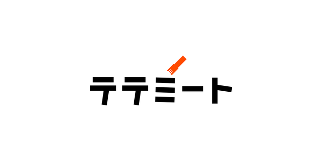

# Lightning Talk

2025-05-30 🍗テテミート #13



---

# 自己紹介

- 名前：平良一真
- 所属：株式会社 スカイウイル

Elixirという言語でサーバーサイドエンジニアやっています。

- 動的型付け
- 関数型
- **マイナー**
- **知名度が低い**
- **そんな言語知らない**
  - 毎回言われます・・・


---

# パターンマッチの<br>甘い罠


---

# パターンマッチ（パターンマッチング）とは

- 関数型言語における、データを照合するための言語機能
  - 定数との照合はもちろん、**データ構造との照合**ができる
- Elixirではパターンマッチでの分岐にcase式が用意されている

```Elixir
# 受け取った数値を序数の文字列にするcase式
# 定数とのマッチングであれば、他言語のswitch等とさして変わらない
case number do
  1 -> "1st"
  2 -> "2nd"
  3 -> "3rd"
  _ -> "#{number}th" # 文字列埋め込み
end
```

---

## 例えば以下のようなUserに敬称をつける場合

- `job` が `ninja` の場合は `＝サン` をつける
  - アイエエエ
- `nationality` が `USA` の場合
  - `sex` が `M` の場合は `Mr.` をつける
  - `sex` が `F` の場合は `Ms.` をつける
  - `sex` がない場合は `Mx.` をつける
- `nationality` が `JPN` の場合は `様` をつける

### **これだけでももう割とクソコードになりそうな雰囲気（if...if...if...）**

### さらに `Mrs.` とか `Dr.` とか増えたら地獄

---

# パターンマッチならこう書ける

- Map（Object・Hash）のkey-valueに何を持っているかでマッチできる
  - List（Array）やTupleのマッチも可能
  - さらに、これらが入れ子になった構造に対するマッチも可能
- when節を使って細かい条件を書くこともできる

```Elixir
def title(user) do
  case user do
    %{job: "ninja"}                 -> user.name <> "＝サン"
    %{nationality: "USA", sex: "M"} -> "Mr. " <> user.name
    %{nationality: "USA", sex: "F"} -> "Ms. " <> user.name
    %{nationality: "USA"}           -> "Mx. " <> user.name
    %{nationality: "JPN"}           -> user.name <> "様"
  end
end
```

注） `<>` は文字列連結演算子

---

# （余談）

## さらに、Elixirでは関数の引数でパターンマッチできる

- 複数の同名関数を定義できる
- 関数が呼び出されると上からマッチを試し、マッチした関数ボディが実行される
  - マッチする関数がない場合はエラーとなる

```Elixir
def title(%{name: name, job: "ninja"}),                 do: name <> "＝サン"
def title(%{name: name, nationality: "USA", sex: "M"}), do: "Mr. " <> name
def title(%{name: name, nationality: "USA", sex: "F"}), do: "Ms. " <> name
def title(%{name: name, nationality: "USA"}),           do: "Mx. " <> name
def title(%{name: name, nationality: "JPN"}),           do: name <> "様"
```

---

# パターンマッチ流行中！

## 先の例の通り、データの照合・分岐に役立つ強力な構文

- C#, Java, Python, Rubyなどのオブジェクト指向言語に搭載されている
  - switch文（式）の拡張や、マッチ専用のmatch式の導入で実装される

---

# しかし、使用には注意が必要

## パターンマッチは関数型言語の構文なので<br>オブジェクト指向にそのまま馴染むわけではない！

- パターンマッチはインスタンスの中身を観察・照合する
  - したがって、パターンマッチはカプセル化を破る
    - オブジェクト指向を貫くなら、フィールドをprivateにしてメソッドをpublicにするべき
  - 他方、クラス内で完結するマッチであればカプセル化を破ることはない

## 特に「パターンマッチのためにprivateにできるフィールドをpublicにする」のは絶対にやめよう

---

# まとめ

- パターンマッチは関数型由来の強力な構文
  - 使いこなせると楽しい
- 関数型とオブジェクト指向とではパラダイム（考え方・理念）が大きく異なる
  - オブジェクト指向言語でパターンマッチを扱う際には注意が必要
- Elixirは関数型にしてはとっつきやすいので興味ある方は是非

---


