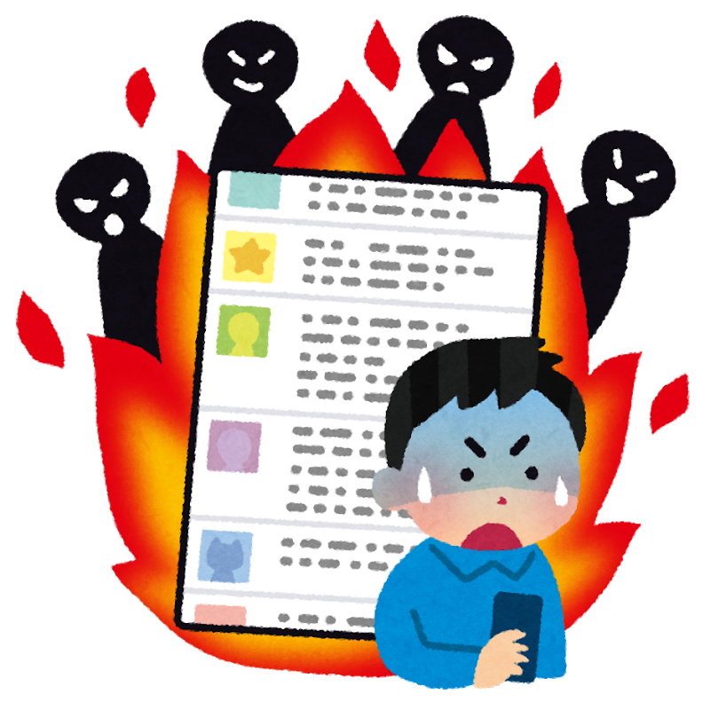

# セキュリティ事例説明

CA Unit 2022-2HUnit会 3月

<!-- セキュリティ事案説明の時間です。 -->
---


# 自己紹介

- 名前：平良一真
- 所属：ASD推進室

<!--
私は断じて花粉症ではないのですが、最近目がかゆいです。
今回はASD所属のわたくし平良一真がお送りします。
-->

---

# 事案紹介 - SMBC Githubソースコード流出事件

それは2021年1月28日の出来事です。

<!--
今回紹介するのはSMBC Githubソースコード流出事件で、つい2年前の出来事です。
Twitterでトレンド入りして衝撃を与えましたし、事件とは全く関係ないですがプレイヤー人口の多い艦これ界隈から発した事件ということで、記憶にある方も多いのではないでしょうか？
-->

---

# 時系列

1. X氏（やらかしちゃった人）とA氏（某有名ゲームの動画配信者）との間でtwitter上のいざこざが起こる。
1. それが加熱し、口論（レスバトル・リプバトル）へと発展する。
1. それを面白がった傍観者がX氏の過去のツイートを掘り返し、facebook・github等のアカウントが特定される。
1. そして・・・

---



# 大・炎・上

---

# なぜ炎上したか

**Github上にpackage名やCopyright表記に `smbc` や `nttdata` と入ったコードが多数発見される**

## 注) 以下のコードはあくまでイメージです。

```Java
/*
 * Copyright (c) 20xx, HogeTT Data HoGetronics Corporation.
 */
package jp.co.hogettdata.foo.bar.baz;

public class HogeClass {
  // ・・・
```

<!--
SMBC（三井住友銀行）やNTTDATAのソースコードが流出していることが判明しました。
実際のコード内容自体は大したものではなくてそれだけ見ても意味のないものでしたが、「メガバンクやIT最大手のソースコードが流出した」という点に大きな衝撃がありました。
なお、コピーライトなどは無く出どころが不明なコードですが、「所属団体・肩書き・入れ墨有無・犯罪歴」などのプロパティのある暴力団員情報と思われるモデルクラスなんかもありました。
-->

<!--
ところで、「以下のコードはあくまでイメージです。」と書いてあるコードは、実はこの事件で実際に流出したコードを元に書いています。
この事件が炎上したとき、X氏のTwitter上のやりとりが多数web魚拓に保存され、Githubの流出コードは多数forkされたため、いまだに当時のやりとりが魚拓から追えますし、流出したソースコードも少し追いかければ手に入ります。
デジタルタトゥーなどと言われているように、炎上すると影響が残り続けることがわかると思います。
-->

---


# どうしてこうなったのか

- X氏はGithubから年収推定できるという転職サイトに登録するため、 ***(1)業務上のものを含む*** 手元にあったコード全てをGithubの ***(2)publicリポジトリ*** にpushしたという・・・

---

# 問題点1 - 業務上のコードの流用

業務上書いたコードの権利は先方にあり、エンジニアには守秘義務があります。
自分の書いたコードであっても流用は論外です。

<!-- これは当然だと思いますが、今一度肝に銘じておきましょう。 -->

---

# 問題点2 - Github等の権限管理

publicリポジトリは全人類に向けて発信していることを自覚しましょう。
個人的に趣味で書いたコードであっても公開してはいけない情報はたくさんあります。

```Java
public class AwsAccess {
  private static final String ACCESS_KEY = "H22PVGPRJBWARVLM7TWS";
  private static final String SECRET = "V6gXQsJAs/SHZPpzLiZ/aQ6dVDwJGz";

  // ・・・
}
```

<!--
ここに一例としてあげたのがAWSのキーペアです。
多数のbotがgithubのpublicリポジトリをクロールしていて、それっぽい値があるとすぐに抜かれて不正利用されます。
「AWSで不正利用され80000ドルの請求が来た話」とか「初心者がAWSでミスって不正利用されて$6,000請求、泣きそうになったお話。」とか体験談が多数あるので興味があれば読んでください。
-->

---

# 問題点3 - SNSでレスバトルしない

いい歳した大人のやることではないです。

<!-- 人間としての品格が損なわれますので、くれぐれもご注意ください。 -->

---


<!-- 以下は時間があれば -->

<!--
このやらかしちゃったX氏はGitやGithubをあまり使ったことがなく、publicリポジトリにコードをpushすると公開される認識が無かったようです。
その観点からは、この事件はエンジニアとしてのスキル不足が招いたものということもできます。
GitやGithubはソースコード管理のデファクトスタンダードですので、エンジニアとしての必須スキルです。
-->

<!--
もし、これからGit・Githubを勉強するのであれば、入門の入門、勉強の土台作りとしてわかばちゃんのGit入門が読みやすくておすすめです。
Gitはリモートリポジトリ・ローカルリポジトリにおける各ブランチをイメージできることが重要なので、わかばちゃんの漫画でそのイメージが湧くとグッと理解がしやすくなると思います。
なお、このSMBC Github流出事件を模した漫画も2版で追加されているとのことです。
私は読んでいませんが、多分わかばちゃんは炎上せずにpush手前で止めてくれるんだと思います。
-->
