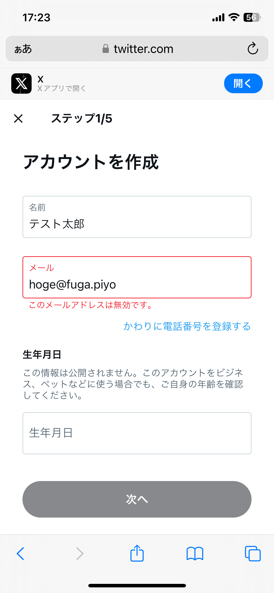

# セキュリティ事例説明

CA Unit 2023-2HUnit会 1月

<!-- セキュリティ事案説明の時間です。 -->
---

# 自己紹介

- 名前：平良一真
- 所属：ASD推進室

<!--
今回はASD所属のわたくし平良一真がお送りいたします。
年末年始は皆様いかがお過ごしだったでしょうか？
私は寝正月になりましたが原因はスライドの通りです。
寒くなるとぎっくり腰やりがちなのでみなさんもお気をつけください。
-->

---

# 事案紹介 - 怪しいお米 セシウムさん事件

それは2011年8月4日の出来事です。

<!--
今回紹介するのは怪しいお米 セシウムさん事件で、もう12年も前の出来事なんですね。
一番若い方で当時小学生ですが、大きな問題になったのでご存じの方も多いと思います。
-->

---

# 事案概要

某局のテレビ番組放送中に、誤ってリハーサル用のテロップが流れてしまいました。

その内容があまりに不謹慎ということで大炎上しました。

---

<!--
これが東日本大震災の半年後に放映されました
岩手県産ひとめぼれのプレゼント企画ということで原発事故の風評被害への支援という意味合いがあったと思うのですがまるで逆効果となり、岩手県知事から直接抗議を受けるような事態となりました。
これの問題点は、言うまでもなく内容が不謹慎だったことに尽きます。
これが「リハーサル花子さん」とか「プレゼント太郎さん」とかだったら、「ただいま誤ったテロップが表示されてしまいました、失礼いたしました。」で済んだ話です。
明らかな人為的ミスです。
-->

---

# ところで・・・

## テストデータってきちんと作れていますか？

<!--
ところで、テレビのリハーサルデータと同じく、エンジニアもテストデータを取り扱います。
弊社にはこのような不謹慎なデータを作って面白がるような人間はいないと思いますが、良いテストデータの作り方って技術ブログのテーマにもあまりならないですし、テストデータ作成についての研修を受けたという方も少ないと思います。
テストデータってなんとなく作っているという方が多いのではないでしょうか？
そこで、ここからはテストデータの作成方針について少しお話をしたいと思います。
-->

---

# テストデータの作成方針

## プロジェクトにガイドラインがあればそれに従う

<!-- まぁこれは当然ですね。プロジェクトの方針に従いましょう。 -->

---

# テストデータの作成方針

## 一目でテストデータとわかるデータにする

- ほげ ふが ぴよ
- foo bar baz
- テスト太郎 試験花子・・・

<!--
セシウムさん事件の例でもわかる通り、dev環境やstaging環境のデータであっても、本番環境に紛れてしまう可能性はゼロではありません。
万一データが本番環境に混入した際に備えて、テストデータかどうか一眼でわかるようにするのが良いでしょう
-->

---

# テストデータの作成方針

## 一目でテストデータとわかるデータにする

**以下のようなデータはやめましょう**

- 自分やチームメンバーの名前・住所等
- 本番環境からダンプしたデータ

<!--
エンジニアは異動・入れ替わりがあるので、過去に携わった人のデータをテストデータかどうか区別するのは難しいです。（でもこういうデータはたくさんあります・・・
本番環境のダンプデータは、流出するとダンプした時点のデータと本番環境の実データが二重になるという恐れがあり大変危険です。
バグ再現のためなど一時的に本番データを開発環境に入れざるを得ない場合もありますが、細心の注意を払う必要があります。
-->

---

# バリデーション問題

テストデータとして無効なデータを入れたいのに入れられない場合があります。

<!--
バリデーションは無効なデータを検知する有益な機能ですが、あえて無効なデータを使いたいテストデータにおいては敵です。
-->

---

# URL・メールアドレス

## example.comを使おう！

これはRFC 2606で「例示のため」として予約されたドメインです。

<!--
万一流出しても安全なことが保証されています。
なお、 `https://hoge.com/` は存在します。
-->

---

# 電話番号

## 総務省の電気通信番号指定状況で確認できる！

https://www.soumu.go.jp/main_sosiki/joho_tsusin/top/tel_number/number_shitei.html

- 固定電話の電話番号の構成

市内局番の指定は総務省が公表 ↓

↑ 市外局番は地域によって固定

<!--
電話番号は東京03-xxxx-xxxxのように「市外局番」「市内局番」「加入者番号」にわかれます。
このうち真ん中の市内局番については指定状況を総務省が公表しています。
-->

---

# 電話番号

## 総務省の電気通信番号指定状況で確認できる！

https://www.soumu.go.jp/main_sosiki/joho_tsusin/top/tel_number/number_shitei.html

例えば、03から始まる番号の市内局番は3100~6999の間でしか指定されていません。

よって 03-1234-5678 は存在しない番号となります。

<!--
よって、指定されていない番号は存在しない番号であることが確定します。
ただし、その後指定がされる可能性がないわけではないので注意してください。
 -->

---

# 電話番号

## 総務省の電気通信番号指定状況で確認できる！

https://www.soumu.go.jp/main_sosiki/joho_tsusin/top/tel_number/number_shitei.html

また、携帯電話番号やフリーダイヤル等の指定状況も公表されています。

興味あれば上記サイトをご覧ください。

---

<!-- それでは本年も良いテストデータライフを過ごせますように。以上、ご清聴ありがとうございました。 -->
