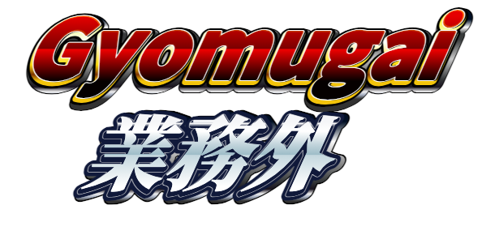

# キャリア紹介

CA Unit 2023-2HUnit会 5月

---

# 自己紹介

- 名前：平良一真
- 所属：ASD推進室
- エンジニア歴：7年
- スカイウイル歴：1年半
- ~~法律学歴：10年~~

---

# イベント好きですか？

<!--
小規模：もくもく会・LT会・モブペアプロ会
中規模：ハッカソン・ハンズオン
大規模：カンファレンス・サミット

イベント参加したことあるかを会場に聞く

イベントに参加したきっかけは組み込み中心のレガシーな会社でエンジニアとして師事したと思える人が社内にいなかった
そのため、外部イベントで他のエンジニアと交流してみたかった
-->

---

# 思い出深いイベント1

## C#もくもく会

<!--
時間を使いすぎない程度にC#の話
最初に業務で触った言語
言語にこだわらない方が良い

初めて参加したイベント
勉強会は若手中心と思っていたが、参加者の年齢層が高かったこと
それゆえ発表内容のレベルが高かったこと

中堅以上の世代も休日や仕事終わりに勉強会に来ていることを知り、それ以上に勉強しないと追いつけないと思った
-->

---

# 思い出深いイベント2

## Code Retreat

<!--
各世代入り混じったペアプロ・モブプロイベント

若手同士では引っ張っていくことができ、上級者の話題にはついていくことができた
コーディングイベント運営の手法を学んだ
自信が生まれたイベント
-->

---

# イベントのここが好き！

---

## ここが好き！

1. **参加者のレベルが高い**
1. **他社のオフィスにお邪魔できる**
1. **なんの気兼ねもなくコードが書ける**

<!--
1. 休日や業務後にイベント参加しようという意欲あるエンジニアばかりなので
2. 他のIT企業のオフィスや自習スペースなどに入れるのはイベントだけの特権
私は10社くらいは行っているが、各社特徴があって楽しい
3. 好きな言語・フレームワークでバグもデグレも気にせずコードが書けるというのは、業務では味わえないイベントならではの醍醐味
-->

---

# イベントのここがダメ！

---

<!--
_footer: 画像出典 5000兆円ジェネレーター super様 https://yurafuca.com/5000choyen/
-->

<!--
業務でしかコード書きたくないと思うか思わないかは、エンジニアの資質があるかないかの分水嶺と思う
-->

---

<!--
ご清聴ありがとうございました
-->
